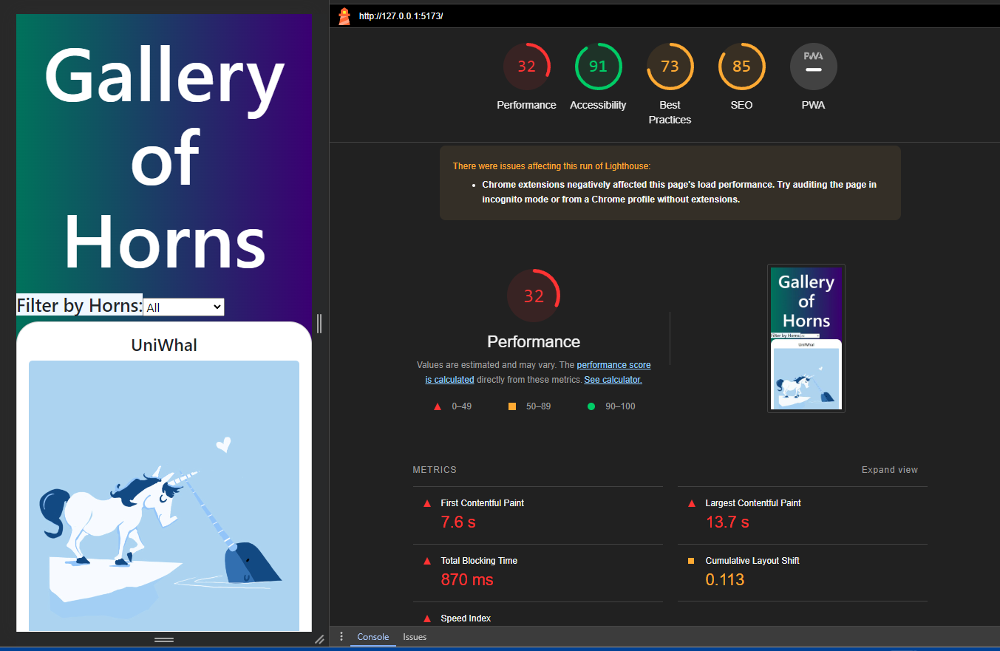

# React + Vite Template

This template provides a minimal setup for React in Vite with Hot Module Replacement (HMR) and ESLint rules. Two official plugins are available:

- [@vitejs/plugin-react](https://github.com/vitejs/vite-plugin-react/blob/main/packages/plugin-react/README.md) (Uses Babel for Fast Refresh)
- [@vitejs/plugin-react-swc](https://github.com/vitejs/vite-plugin-react-swc) (Uses SWC for Fast Refresh)

## React State and Props - Overview

Create an application that displays images and information of horned animals. Users can filter beasts by the number of horns and favorite their chosen beasts.

### Resources:
- [data.json](#) (Link to your JSON file)
- [Netlify](https://latheriokidd.netlify.app/)

### Time Estimates

#### Feature #1: Display Images

- **Why:** Allow users to view images on the page.
- **What:** Display all beast images in the gallery.
- **How:** Pass title, image, and description props to each HornedBeast component.

    - *Estimate:* 1.5 hours
    - *Start Time:* 6:00 pm
    - *Finish Time:* 8:30 pm
    - *Actual Time:* 2.5 hours

#### Feature #2: Allow Users to Favorite Individual Beasts

- **Why:** Enable users to interact with the site and favorite beasts.
- **What:** Increase the number of favorites when a user clicks on an image.
- **How:** Create state in HornedBeast component to track favorites.

    - *Estimate:* 1.5 hours
    - *Start Time:* 8:30 pm
    - *Finish Time:* 10:00 pm
    - *Actual Time:* 2.5 hours

#### Feature #3: Bootstrap

- **Why:** Create a visually pleasing, responsive application.
- **What:** Render images in visually pleasing columns.
- **How:** Use the react-bootstrap library for styling.

    - *Estimate:* 2.5 hours
    - *Start Time:* 10:00 pm
    - *Finish Time:* 1:20 am
    - *Actual Time:* 4.5 hours

## Lab: Class 03

### Feature #1: Display a Modal

- **Why:** Allow users to view larger images with descriptions.
- **What:** Render larger images in a modal with descriptions.
- **How:** Import data from data.json, map over the data in Gallery, create a SelectedBeast component using React Bootstrap.

## Lab: Class 04 - Forms and Filter

### Overview

The final class adds functionality for filtering beasts by the number of horns.

### Feature 1: Filter by Numbers of Horns

- **Why:** Allow users to view beasts based on the number of horns.
- **What:** Build a dropdown menu for filtering.
- **How:** Use the Form component of react-bootstrap to create a dropdown menu for filtering by the number of horns.

    

